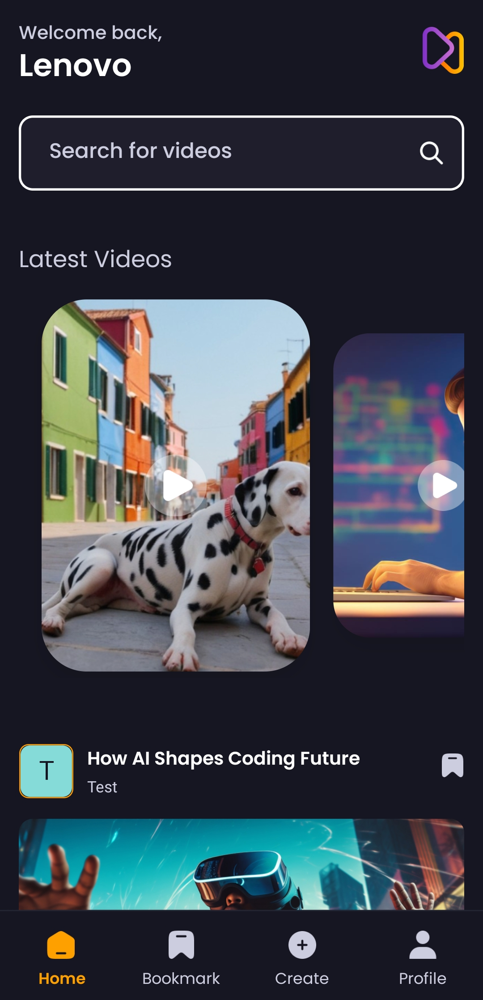

# AORA

## 📌 Project Overview
AORA is a modern web application built using React Native and Expo, designed for seamless authentication and content browsing. The project integrates Appwrite for backend services, enabling secure authentication, data storage, and management.

## 🖼️ Preview




## ✨ Features
- **Authentication System**: Secure login and signup using Appwrite.
- **Search Functionality**: Users can search for content effortlessly.
- **Bookmarking**: Save favorite items for easy access later.
- **Trending Section**: Showcases trending content dynamically.
- **Custom UI Components**: Reusable UI components for a better user experience.
- **Dark Mode Support**: Aesthetic and user-friendly UI with dark theme compatibility.

## 🛠 Tech Stack
- **Frontend**: React Native, Expo
- **Backend**: Appwrite
- **State Management**: Context API
- **UI/Styling**: Tailwind CSS (or equivalent styling approach)
- **Navigation**: React Navigation

## 🚀 Installation & Setup
### Prerequisites
Ensure you have the following installed on your system:
- Node.js
- Expo CLI
- Appwrite (Cloud or Self-hosted)

### Steps to Run Locally
1. Clone the repository:
   ```sh
   git clone https://github.com/Sankalp20Tiwari/aora.git
   cd aora
   ```
2. Install dependencies:
   ```sh
   npm install
   ```
3. Configure Appwrite credentials in `lib/appwrite.js`:
   ```js
  export const appwriteConfig = {
  endpoint : '',
  platform: '',
  projectId: "",
  databaseId: "",
  userCollectionId: "",
  videoCollectionId:"",
  storageId: "",
  bookmarkCollectionId: ""
  }
   ```
4. Start the development server:
   ```sh
   expo start
   ```

## 📁 Folder Structure
```
AORA/
│── app/
│   ├── (auth)/          # Authentication screens (Sign-in, Sign-up)
│   ├── (tabs)/          # Tab navigation components
│   ├── search/          # Search-related UI
│   ├── assets/          # Static assets (images, icons)
│── components/          # Reusable UI components
│── constants/           # Constants like icons and images
│── context/             # Context API providers
│── lib/                 # Appwrite configuration & hooks
│── node_modules/        # Dependencies
│── package.json         # Project metadata and dependencies
│── app.json             # Expo configuration
```

## 🎯 Usage
- Run the application and navigate through the authentication system.
- Search for content using the search feature.
- Bookmark content for later access.
- View trending content dynamically.

## 🤝 Contributing
Contributions are welcome! Follow these steps:
1. Fork the repository.
2. Create a new branch: `git checkout -b feature-name`
3. Make your changes and commit: `git commit -m "Added new feature"`
4. Push changes: `git push origin feature-name`
5. Submit a pull request.

---

Feel free to update the repository link and Appwrite credentials as needed!

